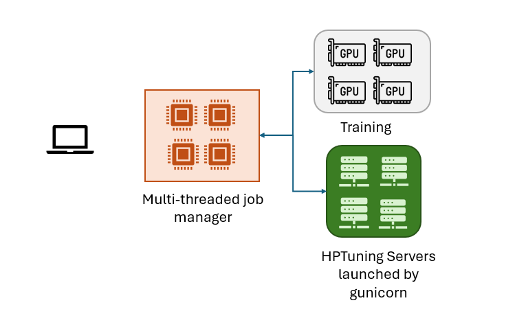

# quante_carlo
## Batch Hyperparameter Tuning
- Multiprocessing and multi-GPU support
- Great for figuring out Neural Network Architectures
- Uses <a href="https://hal.science/hal-00732512v2/document">Bayesian Optimization Algorithm</a>
quante.carlo(f, limits, kernel, n_batches, n_processors, n_iterations, keep_thread_id=False)

### Parameters
<table>
   <tr>
      <td><ins><v>Parameter Name</b></ins></b></td><td><ins><b>Description</b></ins></td>
   </tr>
   <tr>
      <td><b>f<b> </td> </td><td>evaluation function</td>
   </tr>
   <tr>
      <td><b>limits</b></td><td>list of parameter ranges</td>
   </tr>
   <tr>
      <td><b>kernel</b> </td><td> kernel functions for Gaussian Process Regressor from sklearn.gaussian_process.kernels</td>
   </tr>
   <tr>
      <td><b>n_batches</b></td><td>number of batches to use when</td>
   </tr>
   <tr>
         <td><b>n_processors</b></td><td> number of processors; should align with actual hardware</td>
   </tr>
   <tr>
      <td><b>n_iterations</b></td><td> number of iterations to run; can alternatively specify a stopping criteria</td>
   </tr>
         <td><b>logfile_location</b></td> <td> this file will be overwritten </td>
   </tr>
</table>

## Tutorial
before you run the module, you start up the servers
<code>gunicorn -w 24 'flask_worker:app'</code>

On the one hand, multi-threading is fast but unstable and potentially unsuitable. On the other hand spawning is thread safe, yet requires respawning at each iteration. gunicorn is a stable, multi-process gateway that allows the hyperparameter tuners to act as a microservice. The processes do not exit upon completion and so, do not need to be re-spawned. Also, gunicorn is very stable: it restarts automatically and traps exceptions.
1. A multi-threaded pool is created using the multiprocessing module to be used as a parallel job manager.
2. The job manager first chooses the initial hyperparameters randomly.
3. The job manager uses the user defined modules to make calls to the GPU. Each instance of the module has it's own instance of a data loader. This approach scales across multiple machines and it allows each job to have a different set of hyper-parameters. The result of this step is an error or loss score for each trained model.
4. The scores are passed to the hyperparameter microservice via API which returns the best next choice for hyperparameter tuning.
Steps 3 and 4 are repeated. Each time, the history is passed to the hyperparameter tuning service. The hyperparameter tuner transforms the data into a lognormal distribution. (Batch) expected improvement works better when the data is lognormal. The initial distribution is irrelevant. Some variables such as the betas in the Adam optimizer are usually tested on a log scale. After the transformation, the hyperparameter tuner can easily handle this skew. However, if you want to focus on an exponential distributed parameter, then you can handle that in the user-defined function, for example, by passing the log of the parameter to the hp tuner.
